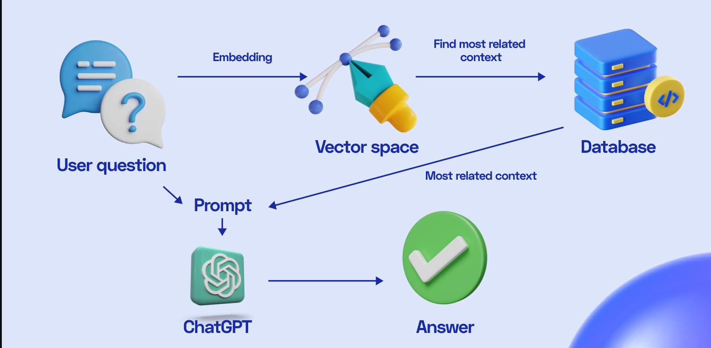

# OpSec-Assistant
OpSec Assistant is a Exclusive customer service that can help you thoroughly understand OpSec.

# Goal
After crawling information about OpSec, this AI customer service can answer any question regarding to OpSec. Utilizing AI, RAG, LLm technique. Our OpSec Assistant can efficiently assist users in resolving issues.

# Work flow


# Endpoint for simply use
```
https://opsec-assistant.onrender.com/docs
```

# Execution Frontend
```
streamlit run app.py --server.port 7666
```

# Execution Backend
```
uvicorn server:app --port 8080 --reload
```
And you can see the swagger link
```
http://127.0.0.1:8080/docs
```


# Local Server vector db
```
http://172.21.10.105:6333/
```